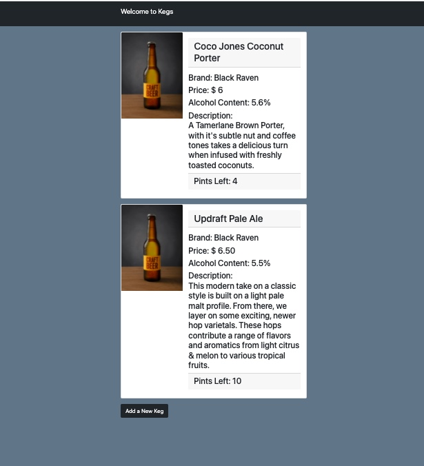
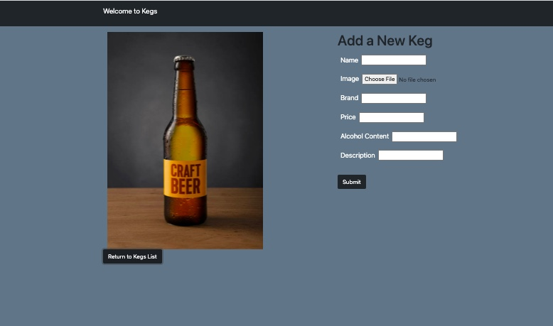
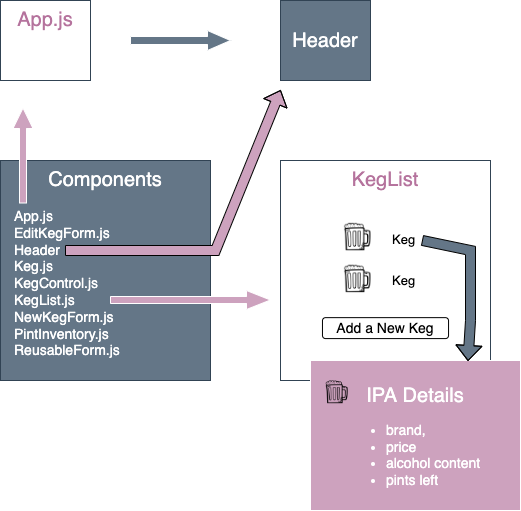
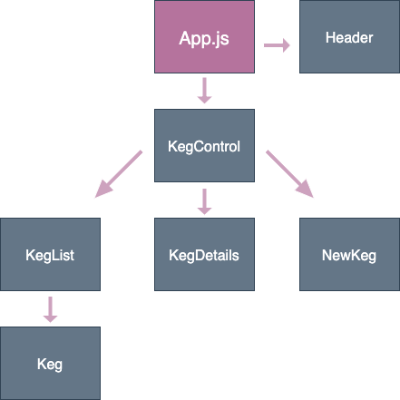

# Kegs Tracker
This application tracks kegs for a tap room. It displays a list of kegs available and a user can create, read(view keg details), update and delete kegs.

#### By Karen Axon

<div>
  <p align="center">
  
  </p>
  <p align="center">
  
  </p>
</div>


## Components Diagram

<p align="left">

</p>

## Data Flow Diagram

<p align="left">

</p>


## Technologies Used

* React
* Javascript / JSX
* HTML
* CSS
* Bootstrap
* NPM


## Setup/Installation 

* Click on the [repository's](https://github.com/karenaxon/kegs-tracker.git) link.
* Click on the green "Code" button and copy the repository URL.
* Open your terminal and navigate to the location where you would like to clone the application.
* Use the command _git clone https://github.com/karenaxon/kegs-tracker.git_ to clone the repository.
* From the root directory of the application, the kegs-tracker, run the following commands:
  - _npm install_
  - _npm run start_
* Navigate to ```localhost:3000``` in your favorite web browser to view the project.


## Known Bugs
* None


## License

[MIT](https://choosealicense.com/licenses/mit/)

Copyright (c) February 2022 - Karen Axon


## Contact Information:

<h3>Karen Axon</h3>

[](https://github.com/karenaxon)
[](https://www.linkedin.com/in/kaxon)
